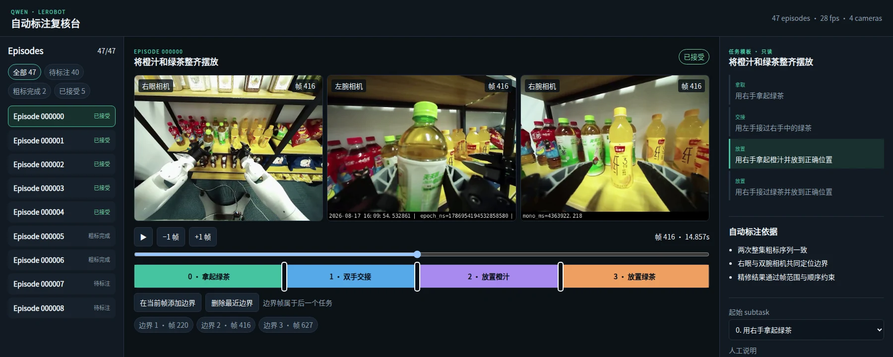
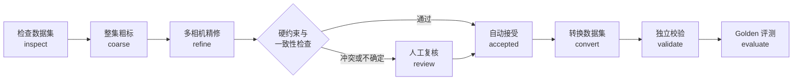
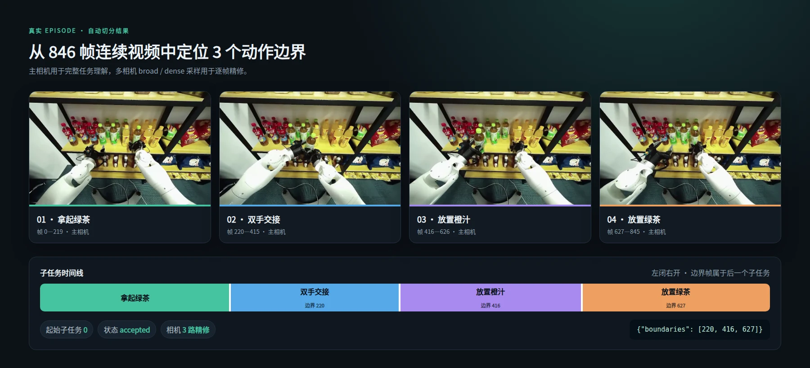

<div align="center">

# Robo-annotate

**面向具身智能的开放式半自动标注引擎。**

*The open annotation engine for embodied AI.*

[](https://www.python.org/)
[](https://github.com/huggingface/lerobot)
[](https://huggingface.co/Qwen)
[](#开发与测试)

[快速开始](#快速开始) · [界面预览](#可视化复核) · [标注效果](#标注效果) · [完整操作手册](docs/operations.md)



</div>

---

Robo-annotate 是一个面向具身智能数据的半自动标注引擎。当前内置的首个工作流支持 **LeRobot v2.1** 数据集，并通过 OpenAI-compatible API 接入 Qwen3.8-27B：你只需要提供高层任务、按顺序排列的子任务模板和相机名称，系统就会完成整段理解、边界精修、约束检查和结果持久化。

它不是“模型给出一个答案就直接写回数据集”的一次性脚本。每个自动结果都有采样来源、模型版本、配置指纹和状态记录；低置信度、结果冲突或违反硬约束的 episode 会进入人工复核，而不会被静默发布。

## 核心能力

| 能力 | 说明 |
| --- | --- |
| 两阶段自动标注 | 先对完整 episode 做稀疏粗定位，再围绕候选边界进行高密度精修 |
| 多相机联合判断 | 使用主视角理解全局任务，并结合眼部、左右腕部等相机定位动作切换 |
| 模板约束输出 | 模型只能从 YAML 中给出的有序子任务选择，不能临时发明标签 |
| 自动拦截异常 | 两次粗标不一致、相机证据冲突或边界非法时自动进入 `needs_review` |
| 可视化人工复核 | 多路视频同步播放、逐帧移动、拖拽边界、人工接管和审计记录 |
| 可恢复批处理 | episode 级原子状态持久化，重复运行可从 `coarse_done` / `refine_done` 继续 |
| 安全发布 | 标注阶段只读源数据；转换写入新目录，并在发布前执行独立一致性校验 |
| 离线质量评测 | 支持 golden set 的边界误差、覆盖率、约束阻断率和错误接受检查 |

## 工作流程



### 两阶段推理

1. **整集粗标**：在主相机上生成两组覆盖完整时间范围的稀疏采样，独立判断起始子任务、已观察到的子任务序列和候选边界。
2. **边界精修**：围绕每个候选点，先对多路相机做 broad window 判断，再在小范围内逐帧 dense 判断。
3. **确定性校验**：检查子任务顺序、边界数量、严格递增、有效范围和最短片段长度。
4. **状态分流**：证据一致且满足约束的结果进入 `accepted`；其余结果进入 `needs_review` 或 `failed`。

## 标注效果



以图中的真实 episode 为例，模型把 846 帧视频切分为 4 个连续子任务，并输出 3 个左闭右开的边界：

```json
{
  "episode_index": 0,
  "start_subtask_index": 0,
  "boundaries": [220, 416, 627],
  "status": "accepted"
}
```

`boundaries: [220]` 表示：

```text
前一个子任务：[0, 220)
后一个子任务：[220, ...)
                      ↑ frame 220 属于后一个子任务
```

> 图中使用真实机器人数据与真实 workspace 结果展示标注形式。单个示例不代表完整精度评测；正式发布前请使用自己的 golden set 执行 `evaluate`。

## 可视化复核

启动本地复核台：

```bash
uv run Robo-annotate review ./runs/drink-arrangement --serve
```

浏览器访问 `http://127.0.0.1:8765` 后，可以：

- 按状态筛选和切换 episode；
- 同步播放全部相机，逐帧或每次 10 帧移动；
- 在彩色时间线上查看当前子任务和边界；
- 拖拽、添加或删除边界，并实时执行硬约束校验；
- 查看自动标注依据，对 `pending`、`failed` 或已接受结果进行显式人工接管；
- 将人工决定原子写回 workspace，同时保留来源指纹和审计信息。

默认只监听 `127.0.0.1`。如果需要监听其他地址，请先评估访问控制与数据安全风险。

## 快速开始

### 1. 安装引擎

运行要求：

- Python `3.12`
- [uv](https://docs.astral.sh/uv/)
- 可读取的 LeRobot `v2.1` 数据集
- 能提供 OpenAI-compatible 接口的 Qwen3.8-27B 推理服务
- 下载模型时需要可用的 `hf` 命令行工具

```bash
uv tool install git+https://github.com/jokeru8/Robo-annotate.git
Robo-annotate --help
```

安装只包含 Robo-annotate 引擎和 Web 复核台，不会下载模型或启动推理服务。你可以填写已有的 OpenAI-compatible API/vLLM 地址。

### 2. 下载并固定模型版本

```bash
export QWEN_MODEL_DIR=/path/to/models/Qwen3.8-27B

uv run Robo-annotate model download \
  --repo Qwen/Qwen3.8-27B \
  --local-dir "$QWEN_MODEL_DIR" \
  --max-workers 8
```

命令会把远端 revision 解析成不可变 commit SHA，校验仓库文件，并在模型目录中写入 `model-install.json`。未通过完整性验证的目录不会被当作可信安装。

### 3. 启动 vLLM

下面是项目当前使用的单 GPU 起步配置。不同硬件、模型量化方式和并发数需要重新验证显存与吞吐。

```bash
CUDA_VISIBLE_DEVICES=0 vllm serve "$QWEN_MODEL_DIR" \
  --served-model-name Qwen/Qwen3.8-27B \
  --tensor-parallel-size 1 \
  --max-model-len 131072 \
  --max-num-seqs 8 \
  --trust-remote-code \
  --port 8000
```

### 4. 创建配置

```yaml
source: ./data/lerobot-source
work_dir: ./runs/drink-arrangement
mode: complete

high_level_instruction: 将橙汁和绿茶整齐摆放
primary_camera: observation.images.right_eye
refine_cameras:
  - observation.images.right_eye
  - observation.images.left_wrist
  - observation.images.right_wrist

subtasks:
  - skill: pick
    text: 用右手拿起绿茶
  - skill: handover
    text: 用左手接过右手中的绿茶
  - skill: place
    text: 用右手拿起橙汁并放到正确位置
  - skill: place
    text: 用右手接过绿茶并放到正确位置

model:
  name: Qwen/Qwen3.8-27B
  local_path: /path/to/models/Qwen3.8-27B
  endpoint: http://127.0.0.1:8000/v1
  api_key: local

sampling:
  coarse_fps: 1.0
  coarse_max_frames: 64
  refine_window_seconds: 2.5
  refine_fps: 8.0
  dense_radius_seconds: 0.5
  agreement_tolerance_frames: 12
  min_segment_frames: 8
```

配置使用严格 schema，未知字段会直接报错。任何影响行为的配置、prompt、模型 revision 或源数据变化都会改变运行指纹，旧 workspace 不会被静默复用。

仓库也提供两个可直接修改的样例：

- [完整任务配置](examples/complete.yaml)
- [DAgger 补丁配置](examples/dagger_patch.yaml)

### 5. 运行完整流程

```bash
# 推理前只读检查
uv run Robo-annotate inspect config.yaml

# 先用单个 episode 做 smoke test
uv run Robo-annotate annotate config.yaml \
  --episodes 0 \
  --max-concurrency 1

# 确认无误后再批量运行
uv run Robo-annotate annotate config.yaml --max-concurrency 2

# 查看状态与人工复核
uv run Robo-annotate status ./runs/drink-arrangement
uv run Robo-annotate review ./runs/drink-arrangement --serve

# 创建新的已标注数据集并做独立校验
uv run Robo-annotate convert ./runs/drink-arrangement \
  --output ./data/lerobot-annotated
uv run Robo-annotate validate ./data/lerobot-annotated \
  --source ./data/lerobot-source
```

完整转换要求所有 episode 都为 `accepted`。如果只想发布已接受子集，需要显式使用 `--accepted-only`；系统会连续重编号 episode、frame 和全局 index，并重新计算统计量。

## 两种数据模式

| 模式 | 适用场景 | 合法结果 |
| --- | --- | --- |
| `complete` | 从头到尾完成标准任务的完整轨迹 | 必须从子任务 0 开始，按顺序完成全部 N 项，并产生 N−1 个边界 |
| `dagger_patch` | 从任务中途开始或提前结束的修正轨迹 | 可以从任意子任务 k 开始；结果只能是单项 `[k]`，或完整后缀 `[k, ..., N−1]` |

这两种模式共用同一套 YAML 子任务模板。对于 DAgger 数据，不需要预先填写起始子任务，coarse 阶段会从视觉证据中判断。

## Workspace 与输出

标注阶段不会复制或修改源 parquet / video。中间结果保存在独立 workspace：

```text
runs/drink-arrangement/
├── manifest.json          # 数据、配置、模型与 prompt 来源
├── summary.json           # 可恢复的状态摘要
├── episodes/
│   └── episode_000000.json
├── logs/
│   └── run.jsonl          # 状态转换审计链
└── previews/              # 离线复核页面
```

`episodes/*.json` 是权威状态。重复执行相同标注命令时，系统会跳过终态 episode，并从已保存阶段继续；如果 source、配置、prompt 或模型来源不一致，则拒绝继续运行。

`convert` 会创建一个新的 LeRobot 数据集，并写入公开标注：

```text
lerobot-annotated/
├── data/
├── videos/
└── meta/
    ├── lerobot_annotations.json
    ├── task_info/
    ├── info.json
    ├── stats.json
    └── episodes_stats.jsonl
```

输出目录已存在时，转换会拒绝覆盖。

## 可靠性设计

- **源数据只读**：`inspect`、`annotate`、`review` 和 `evaluate` 不修改 source。
- **失败即关闭**：来源指纹、模型 revision、prompt 或配置不匹配时停止复用旧状态。
- **结构化响应**：coarse / refine 都使用严格 JSON schema，格式修复也受有限重试约束。
- **确定性约束**：子任务顺序、边界数量、取值范围和最短片段长度由代码独立验证。
- **敏感信息隔离**：API key、模型内部响应和 confidence 不写入发布数据集。
- **安全发布**：转换使用新目录、原子写入和发布后独立校验，不覆盖已有输出。
- **可追溯**：episode 保存采样帧、相机、prompt 版本、模型 SHA 和状态转换记录。

## 质量评测

准备人工标注的完整任务数据集作为 golden set 后运行：

```bash
uv run Robo-annotate evaluate ./runs/drink-arrangement \
  --golden ./data/lerobot-golden \
  --output ./evaluation-report.json
```

评测会报告：

- 边界绝对误差的中位数和 P90（帧 / 秒）；
- 起始子任务准确率；
- 自动接受覆盖率、需复核率和失败率；
- 硬约束违规是否被成功拦截；
- 明显错误是否被错误接受；
- 内置 launch gates 的逐项结果。

当前仓库中的真实运行记录用于开发验证和界面展示，**47 episode golden benchmark 尚未完成**。请不要把部分运行、mock 测试或旧 prompt 的结果描述为完整 launch gate 成功。详细实测记录见 [操作手册](docs/operations.md)。

## 命令速查

| 命令 | 用途 |
| --- | --- |
| `Robo-annotate inspect CONFIG` | 推理前只读检查 LeRobot 数据集 |
| `Robo-annotate annotate CONFIG` | 执行 coarse + refine 批量标注 |
| `Robo-annotate status WORK_DIR` | 查看 workspace 状态 |
| `Robo-annotate review WORK_DIR --serve` | 启动多相机可视化复核台 |
| `Robo-annotate review WORK_DIR` | 生成离线静态复核页面 |
| `Robo-annotate convert WORK_DIR --output PATH` | 创建新的已标注数据集 |
| `Robo-annotate validate PATH --source SOURCE` | 独立验证发布结果 |
| `Robo-annotate evaluate WORK_DIR --golden PATH --output FILE` | 运行 golden set 评测 |
| `Robo-annotate model download` | 下载并固定模型 revision |

## 项目结构

```text
src/robo_annotate/
├── pipeline.py          # episode 与批处理编排
├── coarse.py            # 整集稀疏粗标
├── refine.py            # 多相机边界精修
├── constraints.py       # complete / DAgger 硬约束
├── review_server.py     # 本地可视化复核 API
├── review_web/          # 多相机复核前端
├── converter.py         # 完整 / accepted-only 数据集转换
├── release_validator.py # 发布一致性校验
├── evaluation.py        # golden / DAgger 评测
└── workspace.py         # 指纹、恢复与审计
```

## 开发与测试

```bash
# 克隆仓库后安装开发依赖
uv sync --extra dev

# 全量测试
NODE_OPTIONS=--experimental-default-type=module uv run pytest -q

# 命令行 smoke test
uv run Robo-annotate --help
uv run Robo-annotate inspect examples/complete.yaml
```

`tests/test_*.py` 基本与源码模块一一对应，跨模块完整流程见 `tests/test_end_to_end.py`。

## 文档

- [完整操作手册](docs/operations.md)：模型下载、vLLM 启动、批量运行、故障恢复、复核、转换与评测
- [系统设计](docs/superpowers/specs/2026-08-22-qwen38-lerobot-annotation-design.md)：数据边界、状态机与安全约束
- [可视化复核设计](docs/superpowers/specs/2026-08-23-visual-manual-review-design.md)：复核台交互和人工决定协议

## 贡献

欢迎提交 Issue 和 Pull Request。修改行为逻辑时，请同时补充对应测试；修改 prompt schema 或语义时，请递增 prompt 版本，并使用新的空 workspace 验证，避免把旧结果与新行为混用。

---

<div align="center">

**让机器人视频标注从“模型猜一次”，变成可检查、可恢复、可发布的工程流程。**

</div>
